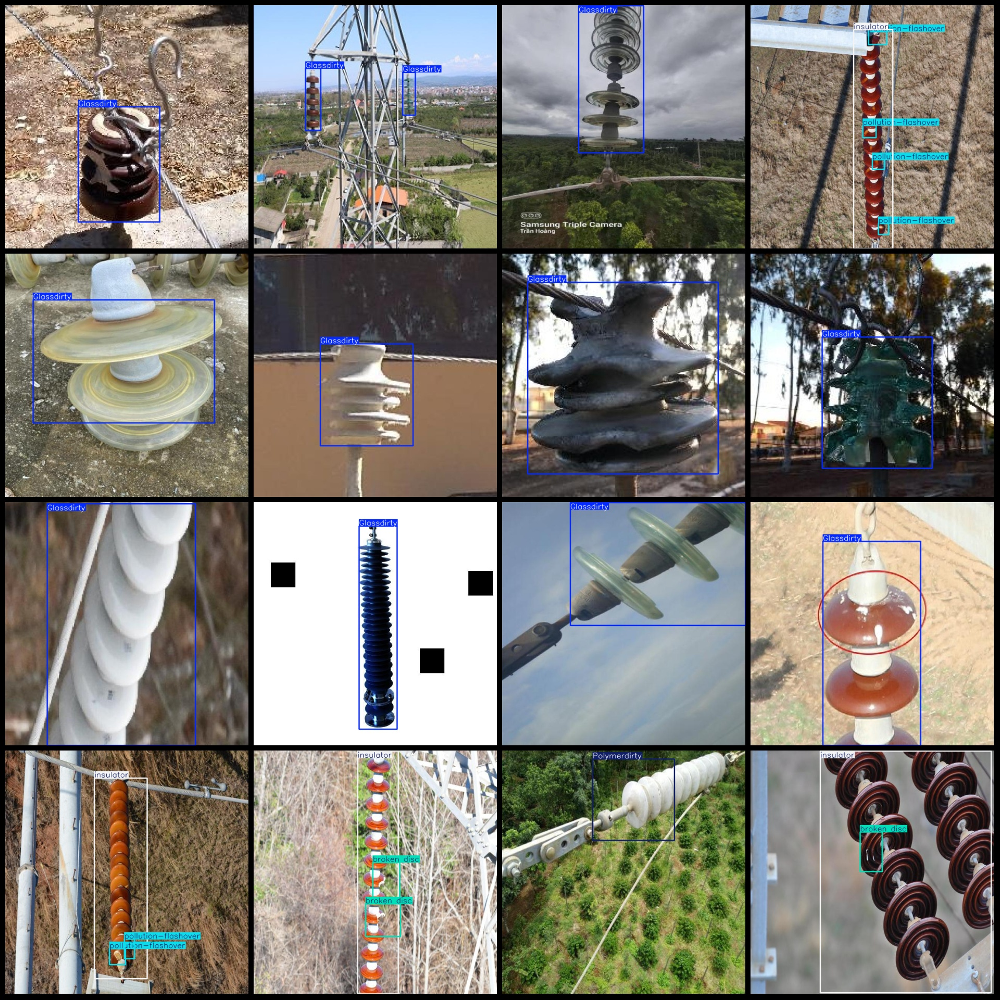
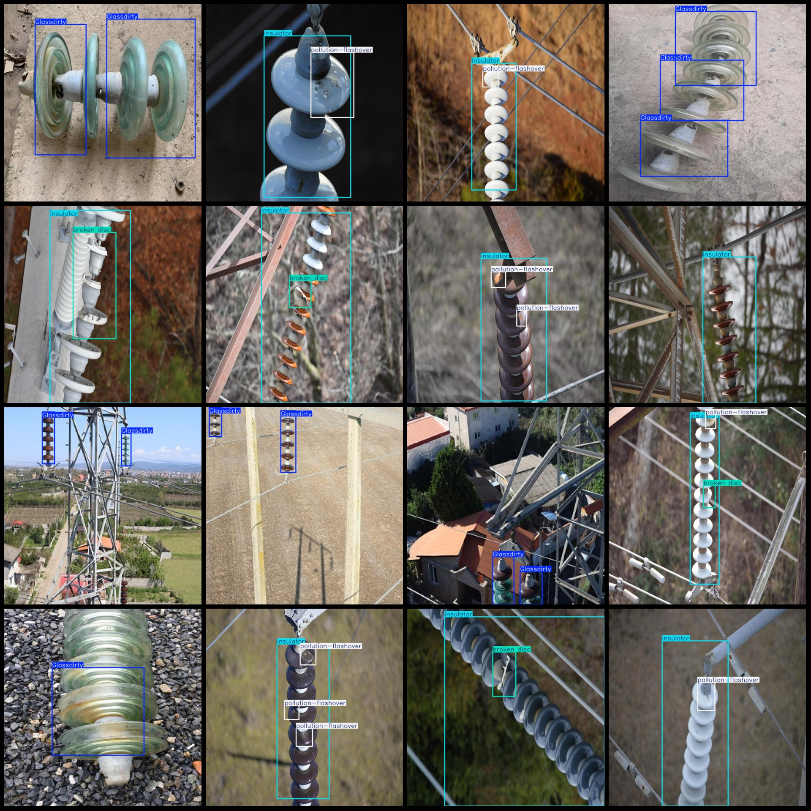

# Power Scene Insulator Defect Detection Data Set in VOC+YOLO Format with 3293 Categories

Dataset format: Pascal VOC format + YOLO format (txt files without split paths, only containing jpg images and corresponding VOC format xml files and yolo format txt files)
Number of image files (jpg): 3293
Number of annotation files (xml): 3293
Number of annotation files (txt): 3293
Number of annotation categories: 9
Annotation category names (not in the order of this list, but according to the labels folder classes.txt): ["Glassdirty", "Glassloss", "Polymer", "Polymerdirty", "Two glass", "broken disc", "insulator", "pollution-flashover", "snow"]
Box counts for each category:
Glassdirty (glass dirt) = 1778
Glassloss (glass missing) = 129
Polymer (composite insulator) = 89
Polymerdirty (composite insulator dirt) = 211
Two glass (dual glass insulator) = 197
broken disc (broken disc insulator) = 808
insulator (insulator) = 1575
pollution-flashover (pollution flashover) = 1471
The number of snowboxes is 9.
total boxes: 6267  
image resolution: 640x640  
Dataset has enhancements: Yes, usually it enhances the image.
The use of annotation tool: labelImg
Annotation rule: Draw a rectangle around the class.
Important notes: None
Special Notice: This dataset does not guarantee the accuracy of the trained model or weight files.
Image preview:
## Images

Here is a pay link on Stripe ( https://buy.stripe.com/3cs8yP7sY87d0vu9AB ). Please contact me lonlonago@foxmail.com after funding $89, and I will send you a complete data files , thank you!

